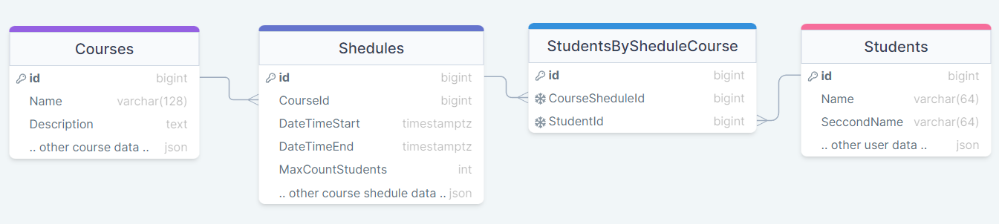
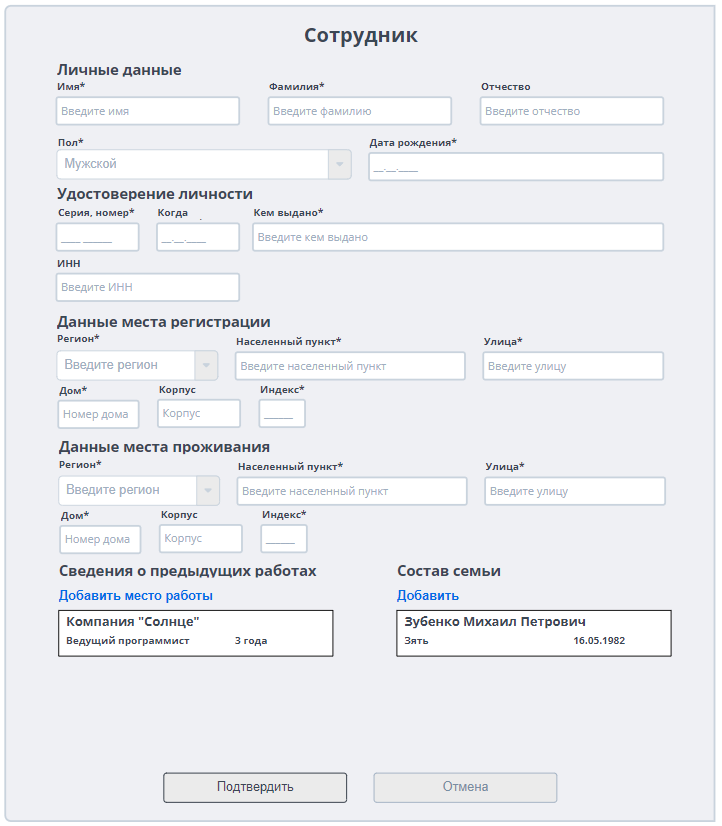

# Тестовое задание в компанию Directum
## Задание 1
Сделано в сервисе DrawSql

Данные о курсе хранятся в таблице Courses
 
Есть возмножсть запустить курс повторно, просто добавив его в таблицу Shedules
 
Студенты привязываются к уже запланированному курсу, находящемуся в Shedules. 
(то есть студент может записать на один и тот же курс если они идут в разное время) 
(Например: курсы C# в 2022 и 2023 году ссылаются на один и тот же курс. 
Студент не может записаться дважды на один и тот же курс. 
Но может записаться на курса 2022 года и 2023 года)

Проверка на запись одного и того же студента на курс происходит при помощи таблицы .
StudentsBySheduleCourse при помощи уникального ключа из двух столбцов: CouseShedulId и StudentId.
 
Проверка также должна проходить в сервисе, который будет работать с данной бд.

Количество мест определяется в таблице Shedules.

## Задание 2

По нажатию на "Добавить место работы" выходит окошечко, в котором мы вводим данные.

Аналогично с составом семьи.

Если количество элементов выходит за экран то появляется скролл бар.

## Задание 3

Решение на задание 3 находится по пути [./CSharp](./CSharp)

Для решения использовал Nuget библиотеки: CommandLineParser, System.CommandLine, NewtonsoftJson

Команты имеют стандартный формат: verb --args values

При вводе команты help можно посмотреть все имеющиеся команды для ввода

### Тестирование

- Проверка ошибок при вводе дат и времени (выход за границы возможных пределов, правильный формат ввода)
- Проверка на ввод начала встречи позже текущего времени и даты
- Проверка ввода правильных аргументов
- Проверка пересечения встреч (новая встреча пересекается в конце, в начале, одна из встреч находится внутри новой встречи)
- Проверка ввода даты встречи для ее поиска в системе (необходимо для удаления и изменения встречи)
- Проверка удаления 
- Проверка изменения данных встречи
- Проверка пересечения встреч при изменении данных встречи
- Проверка работы оповещения
- Проверка работы оповещения после его срабатывания и переноса на другое время (-)
- Проверка правильности вывода данных по дате
- Проверка правильности экспорта данных по дате